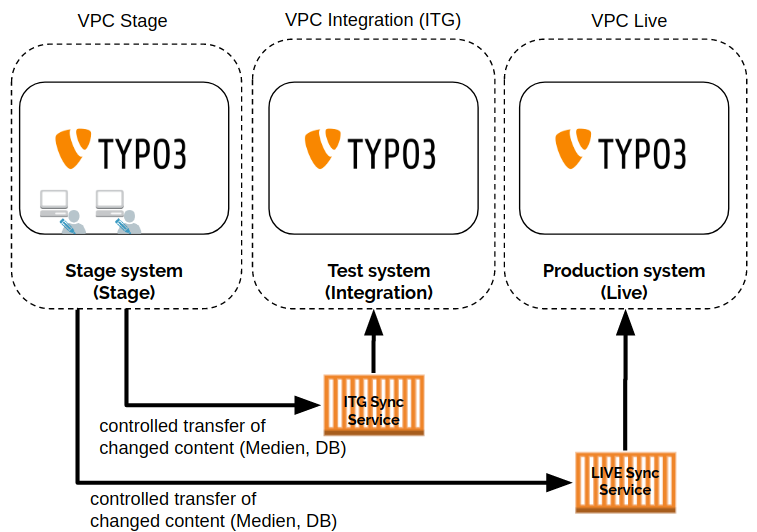
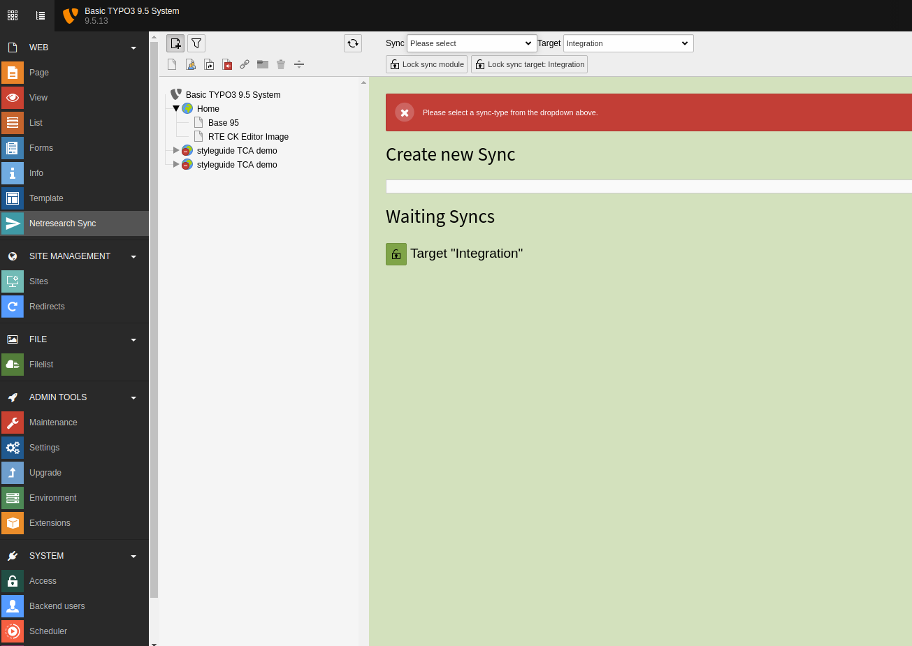

# nr_sync - TYPO3 Content Synchronization

## Introduction

| NOTE: Please be aware that this extension is an alpha version. A lot of refactoring and development is still required to make it "production" ready. Contribution appriciated . |
| --- |

* Prepares your Content for a synchronization wherever you want
* Easy integration for your own extensions
* No content editing on live systems anymore

## Description

The extension provides an easy and editor friendly way to prepare the content for a synchronization to other 
environments e.g. live, testing or development systems. All the synchronizations can be done complete or 
incremental to keep the required load to an absolute minimum. The extension won't do the synchronization by itself.

## Synchronization procedure

1. After creating new or changing existing content, the editor can open the module, can choose the content type
   and will have access only to the content he is allowed to change. The editor can perform a full synchronization.
   So all the content from a choosen table will be prepared for the synchronization. 
   It's also possible to avoid a full sync and execute an incremental sync. So, only
   elements newer or changed since last sync will be added to the new sync.
2. After creating all the dump files required for the synchronization you will find a folder called db in the root
   directory of TYPO3. There you will find subfolders with the target names and within all the required files.
3. The task to transfer the files to the targets systems and apply them to the databases isn't supported by the
   extension itself.

## Technical Notes

### Hooks

``postProcessMenu``

Hook to post process the mod menu.  
Used to add mod menu entry

``preProcessSync``

Hook to pre process variables controlling the sync process.  
Used to configure the sync process to include tables, pages  
or or whatever the sync tool supports.

``postProcessSync``

Hook called after sync process finished.  
Used to run additional processing or do other stuff required for syncing.

Register a hook class::

    $TYPO3_CONF_VARS['SC_OPTIONS']['nr_sync/mod1/index.php']
        ['hookClass'][$_EXTKEY] = 'Example_Sync';

### Features

* At the moment the exception only provides LIVE and INTEGRATION as targets for the sync
* Easy to use BE module
* Easy to extend via Hooks
* Supports two target systems per default
* Supports full and incremental synchronizations

## Installation

* We recommend the installation via composer

    `composer require netresearch/nr-sync`

## Configuration 

### Lock Sync-Module

The Sync module can be locked by Admins. Just select the "Lock Sync Module" Option in the module.

### Message for users in case of active lock

Message for editors, if the Sync Module is locked.

## ToDos

* make target configuration possible
* Add compatibility for TYPO3 10 (hooks vs signlas)
* Refactor Table Model
* Refactor SyncModuleController
* Refactor SyncList
* ...
